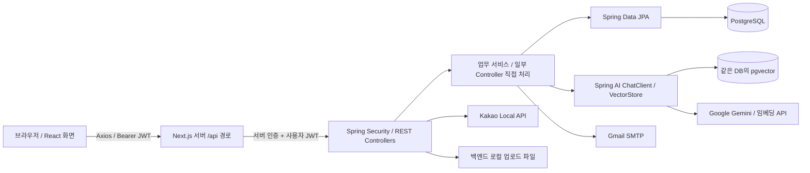
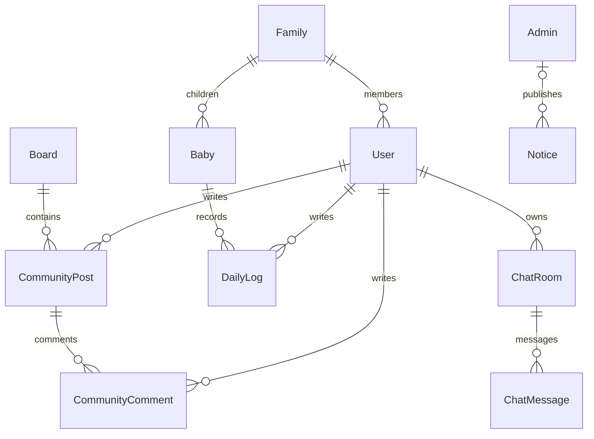

# 시스템 아키텍처

최신 로컬 실행·일반 가입·Redis·배포 준비 상태는 [현재 상태](CURRENT_STATUS.md), [Redis](REDIS_RUNBOOK.md), [배포 작업서](DEPLOYMENT_RUNBOOK.md)를 우선한다. 아래 과거 날짜의 구성과 검증 수치는 이력이다.

2026-09-19 최신: 3단계 main 병합과 실제 DB V2 적용을 완료했다. `ChatContextService`가 상담방의 생성 당시 가족/선택 아이 범위와 현재 권한을 확인하고 제한된 최근 질문·답변을 GeminiService에 공급한다. [3단계 작업서](CHAT_CONTEXT_RUNBOOK.md)를 따른다. 4단계에서는 관리자 미리보기 → 승인된 문서의 트랜잭션 적재 → 현재 버전만 검색 → 실제 전달 자료를 답변과 저장하는 경로를 추가했다. 같은 PostgreSQL에 JDBC 버전 테이블과 기존 pgvector를 사용한다. [4단계 작업서](KNOWLEDGE_RUNBOOK.md)의 V3는 사용자 승인 후 main 병합/실제 적용 및 전후 백업 복원 검증을 완료했다.

2026-09-08 변경: DB 스키마 생성은 Flyway V1로 전환하고 Hibernate/별도 벡터 검증으로 확인한다. 관리자·설정·지식의 시작 자동 적재는 기본 비활성화했다. 초기화/실행 상세와 기존 데이터 전환 조건은 [Flyway 작업서](FLYWAY_RUNBOOK.md)를 따른다. 아래 기술·요청 흐름 분석과 실제 배포 상태는 구분한다.

## 구성과 경계

2단계에서는 서버 전달 경로·서비스 인증·계정 종류/허용 이메일·가족 검증을 보강했다. 아래 도식은 코드의 요청 흐름이다. Cloudflare/Vercel 실제 배포는 미수행이며 [비공개 실행 안내](PRIVATE_BACKEND_RUNBOOK.md)를 따른다.

iCare는 AI 육아 상담, 아기·가족 관리, 육아 일지, 커뮤니티, 병원 검색, 관리자 기능을 제공한다. 프론트엔드와 백엔드는 별도 프로젝트이며, 백엔드는 기술 계층별 패키지를 사용하는 단일 애플리케이션이다.

Compose 포트는 프론트엔드 3000, 백엔드 8080, DB 5432이다. Next.js rewrite는 API 전달을 담당하며 별도 업무 로직이나 세션 검증을 구현하지 않는다. 브라우저의 실제 경로는 `NEXT_PUBLIC_API_URL` 설정에 따라 달라진다.

## 저장소 지도

| 경로 | 역할 |
| --- | --- |
| `babychatboot_frontend/chat-frontend/app` | App Router 페이지, 공통 컴포넌트, Axios |
| `babychatboot_backend/parenting/src/main/java/com/chatbot/parenting` | Spring Boot 애플리케이션 |
| 백엔드 `controller / service / repository / domain / dto` | HTTP / 업무 처리 / DB 접근 / JPA 엔티티 / 전송 객체 |
| 백엔드 `config / util` | 보안, AI Bean, 초기 데이터, JWT |
| 백엔드 `src/main/resources` | 프로파일 설정, 시작 시 읽는 지식 문서 |
| `docker-compose.yml` | DB·백엔드·프론트엔드 컨테이너 연결 |
| `agents` | 현재 구조 분석과 개선 검토 문서 |

## 선언된 기술

| 영역 | 구성 |
| --- | --- |
| 프론트엔드 | Next.js 16.2.1, React 19.2.4, TypeScript 5 계열 |
| UI | Tailwind CSS 4, MUI 7.3.9 이상 범위, Emotion, react-markdown |
| HTTP | Axios 1.15.0 이상 범위 |
| 백엔드 | Java 17, Spring Boot 3.5.13, Maven |
| 데이터·인증 | Spring Data JPA, PostgreSQL, Spring Security, JJWT 0.12.3, BCrypt |
| AI | Spring AI 1.1.5, Google GenAI Chat/Embedding, pgvector, PDF/Tika reader |

근거: 프론트엔드 `package.json`, 백엔드 `pom.xml`, 루트 Compose.

## 주요 흐름

### 회원가입과 인증

1. 회원가입 시 사용자와 가족을 생성하거나 초대코드의 가족에 합류한다. 새 가족이면 아기 목록도 생성한다.
2. 이미 생성된 사용자에 인증코드와 발급 시각을 저장하고 SMTP로 발송한다.
3. 코드 검증은 180초 만료 기준이며, 성공하면 `emailVerified`를 변경한다.
4. 로그인은 비밀번호·이메일 인증 여부를 확인하고 JWT 문자열을 반환한다.
5. 프론트엔드는 `localStorage.accessToken`을 저장하고 Axios가 Authorization 헤더에 붙인다.
6. 필터가 서명·만료를 확인하고 subject 문자열과 `ROLE_` 접두사의 권한을 SecurityContext에 설정한다.

사용자의 MOM/DAD 정보와 인증 권한이 같은 role claim에 들어간다. 관리자 토큰도 동일한 발급기를 사용하며 subject는 관리자 username이다. 이 결합은 [RF-01](REFACTORING.md#rf-01-p0-회원가입-역할과-관리자-권한의-결합)의 원인이다.

### AI 채팅

`chat/page.tsx` → `ChatController` → `GeminiService.askToGemini` 순서다. 서비스가 채팅방 소유자를 검사하고 질문을 저장한 뒤, DB의 시스템 프롬프트와 topK 설정으로 RAG 검색 및 모델 호출을 수행한다. 답변을 저장하고 문자열로 반환하며, 화면은 메시지 목록을 다시 조회한다.

**DB의 대화 기록은 현재 모델 입력에 포함되지 않는다.** 입력은 시스템 프롬프트, 현재 질문, 검색된 지식이다. 메시지 저장 기능과 다중 대화 맥락 기능을 구분해야 한다. 스트리밍이나 별도 작업 큐도 이 경로에 구현되어 있지 않다.

### 육아 일지

`dailylog/page.tsx` → `DailyLogController` → `DailyLogService` → `DailyLogRepository` 흐름이다. 날짜·기간 조회, CRUD, CSV 내보내기를 지원한다. 건강 문진은 컨트롤러가 아기 정보와 일지 통계를 문자열로 조합해 `GeminiService.healthCheck`를 호출한다. 이 메서드에는 채팅용 RAG advisor가 붙지 않는다.

인증은 요구하지만 일지 대상의 가족 소유권 검사는 현재 누락되어 있다. 아기 수정·삭제와 채팅방에서 소유권을 검사하는 것과 다르다.

### 지식 적재

- 시작 시 `KnowledgeLoaderService`가 검색 결과 존재 여부로 초기 적재를 건너뛸지 결정한다. 리소스의 TXT/PDF/Tika 읽기 경로와 고정 splitter가 있다.
- 관리자 텍스트 입력·파일 업로드는 `AdminService`의 별도 경로를 사용한다. 파일은 UTF-8로 읽으며 splitter 값은 DB 설정에서 가져온다.
- 두 경로 모두 `VectorStore.add`로 임베딩·저장을 요청한다. 문서별 버전, 변경 감지, 삭제·교체 이력 모델은 확인되지 않는다.

## 논리 데이터 관계

아래는 엔티티 참조 기준이며, 운영 DB를 조회해 얻은 ERD는 아니다.

`User.family`는 nullable이므로 위 가족 연결은 가족에 가입한 사용자의 관계를 나타낸다. `Category`, `ChatbotConfig`, pgvector 저장소는 별도 참조 없이 조회된다. `Record`는 Baby/User 참조를 가진 별도 엔티티이나 현재 일지 API 경로에서 사용하지 않는다.

## 현재 구조의 장점과 개선 방향

업무 기능 대부분에 서비스·리포지토리 분리가 있고, 일부 API는 DTO를 사용한다. 채팅방·게시글·아기 수정의 소유권 검사는 재사용할 정책의 출발점이다. 개선은 이 장점을 유지하면서 빠진 정책을 공통화하고, 외부 API 호출·파일 저장·화면 상태 로직을 각각 명확한 책임으로 분리하는 방향이 적절하다.
